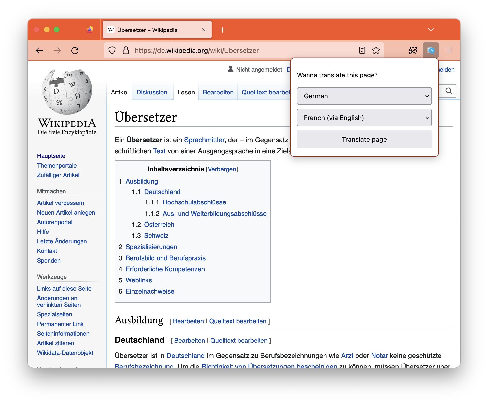

# TranslateLocally for the Browser
TranslateLocally for the Browser is a web-extension that enables client side in-page translations for web browsers. It is a stand-alone extension, but can integrate with [TranslateLocally](https://translatelocally.com) for custom models and even better performance.

TranslateLocally for the Browser is a fork of [Firefox Translations](https://github.com/mozilla/translatelocally-web-ext). It was initially developed in the [Bergamot project](https://browser.mt/) as a testing bed for the technology that went into Firefox Translations.

# Installation in Firefox
- Download the translatelocally.xpi file from [the latest release](https://addons.mozilla.org/en-GB/firefox/addon/translatelocally-for-firefox/).
- If you do this in Firefox, it will prompt you to install it
- Otherwise, open Firefox and drag & drop the downloaded file into it. It will then prompt you to install it.

# Features
- Runs entirely offline (it downloads the necessary language model on demand, but it will never submit any text or metadata to any server.)
- In-page translations, including support for web apps.
- Translates selection
- [Can use TranslateLocally](#instructions-for-native-messaging) for even faster and more efficient translations. And you can import any translation model that is supported by [Marian](https://marian-nmt.github.io).

## Differences from _Firefox Translations_
- Uses models from https://github.com/browsermt/students. Most of these are also available through Mozilla's extension.
- UI is a button + popup instead of the translation bar because the translation bar is not available for unprivileged extensions.
- Translation engine and cache is shared among all tabs and webpages
- Removed form field translation (outbound translations) ([for now](https://github.com/jelmervdl/translatelocally-web-ext/issues/42))
- Removed optional translation quality indicators
- UI is only in English ([for now](https://github.com/jelmervdl/translatelocally-web-ext/issues/43))

# Instructions for development
1. Install Firefox (Nightly for better performance when using WASM)
2. Clone this repo and run `npm install`
3. Run `npm run watch` and wait until Firefox starts
4. Browse to a page in any of the supported languages (https://github.com/browsermt/students) to have the translation option to appear

# Instructions for Native Messaging
1. Download the latest release from the [TranslateLocally](https://translatelocally.com/)
2. …and start it once. This will register the native client with Firefox.
3. Go to about://addons, click "TranslateLocally for Firefox", and click "Preferences".
4. You can then select TranslateLocally as your translation provider in the Preferences pane of the extension settings.

# Google Chrome / Chromium
This branch has experimental support for Google Chrome, including native messaging. However, setup is a bit of a hassle at the moment:

1. Clone or download this repository
2. Open Google Chrome, go to chrome://extensions/, and turn on developer mode (the toggle in top right corner)
3. Click _Load Unpacked_
4. Select the _extension_ folder in your local copy of this repository
5. [Get translateLocally](https://translatelocally.com/)
6. Once you have a binary of translateLocally, run `./translateLocally --allow-client AABBCC` where `AABBCC` is the extension _ID_ Chrome assigned to your installed version of this extension.
7. (Restart Chrome? Not sure this is necessary)
8. Go to the _Extension options_ page of this extension and select _TranslateLocally_ as translation provider.
