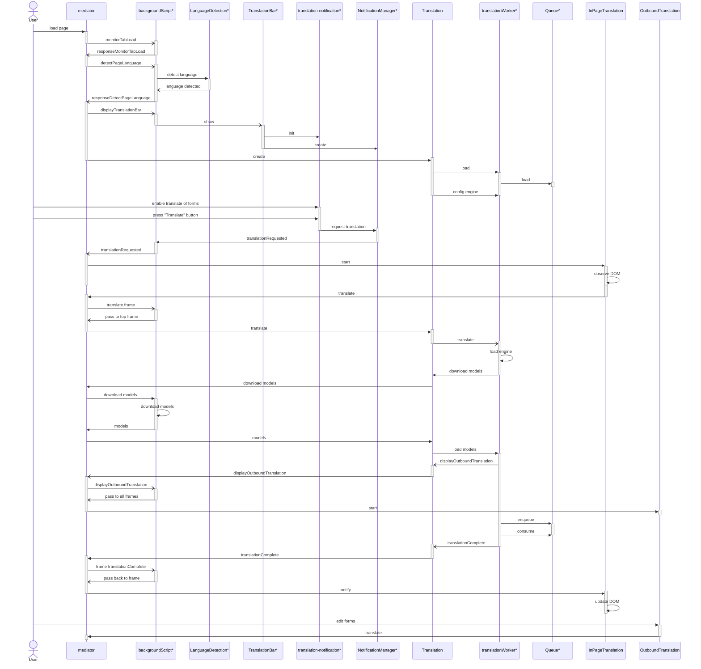

# Message flow

This diagram shows a flow of messages and selected calls for the main translation events. It does not include telemetry, localization, status updates, quality estimation, automatic translation and other secondary functionality for simplicity.

`*` - background scripts,
`^` - web worker scripts,
the rest are content scripts

