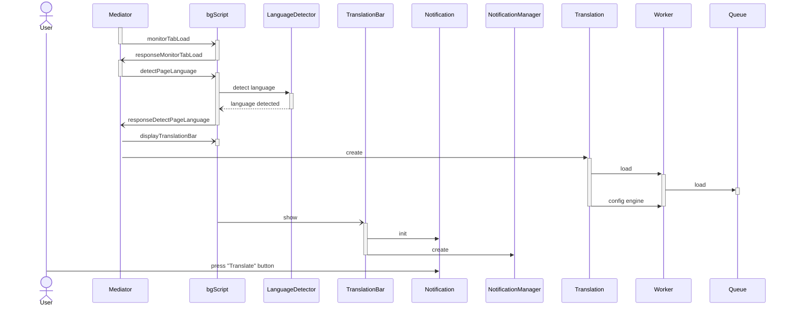

# Message flow

```mermaid
sequenceDiagram
    actor User
    participant m as Mediator
    participant bg as bgScript
    participant ld as LanguageDetector
    participant tb as TranslationBar
    participant nt as Notification
    participant ntm as NotificationManager
    participant t as Translation
    participant w as Worker
    participant q as Queue
    activate m
    m-)+bg: monitorTabLoad
    deactivate m
    bg-)-m: responseMonitorTabLoad
    activate m
    m-)+bg: detectPageLanguage
    deactivate m
    bg->>+ld: detect language
    ld--)-bg: language detected
    bg-)-m: responseDetectPageLanguage
    activate m
    m-)+bg: displayTranslationBar
    deactivate bg
    m->>+t: create
    t->>+w: load
    w->>+q: load
    deactivate q
    t->>w: config engine
    deactivate w
    deactivate t
    bg-)+tb: show
    tb->>nt: init
    tb->>ntm: create
    deactivate tb
    User->>nt: press "Translate" button
```