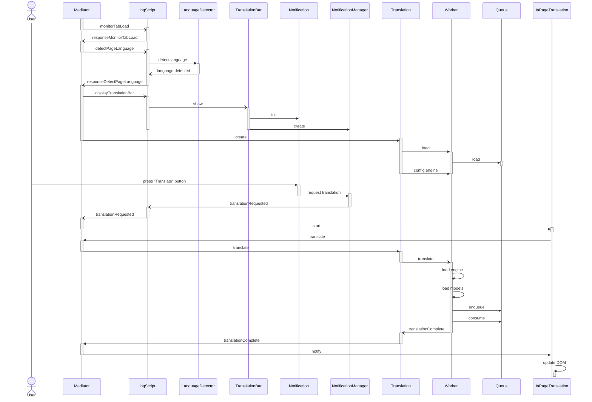

# Message flow

```mermaid
sequenceDiagram
    actor User
    participant m as Mediator
    participant bg as bgScript
    participant ld as LanguageDetector
    participant tb as TranslationBar
    participant nt as Notification
    participant ntm as NotificationManager
    participant t as Translation
    participant w as Worker
    participant q as Queue
    participant ipt as InPageTranslation
    activate m
    m-)+bg: monitorTabLoad
    deactivate m
    bg-)-m: responseMonitorTabLoad
    activate m
    m-)+bg: detectPageLanguage
    deactivate m
    bg->>+ld: detect language
    ld--)-bg: language detected
    bg-)-m: responseDetectPageLanguage
    activate m
    m-)+bg: displayTranslationBar
    bg-)+tb: show
    tb->>nt: init
    tb->>ntm: create
    deactivate tb
    deactivate bg
    m->>+t: create
    deactivate m
    t->>+w: load
    w->>+q: load
    deactivate q
    t->>w: config engine
    deactivate w
    deactivate t
    User->>+nt: press "Translate" button
    nt->>+ntm: request translation
    deactivate nt
    ntm-)-bg: translationRequested
    activate bg
    bg-)-m: translationRequested
    activate m
    m->>+ipt: start
    deactivate m
    deactivate ipt
    activate ipt
    ipt->>+m: translate
    m->>+t: translate
    deactivate m
    t-)+w: translate
    deactivate t
    w->>w: load engine
    w->>w: load models
    w->>q: enqueue
    w->>q: consume
    w-)+t: translationComplete
    deactivate w
    t->>+m: translationComplete
    deactivate t
    m->>+ipt: notify
    deactivate m
    ipt->>+ipt: update DOM
    deactivate ipt

    
    
    
```
